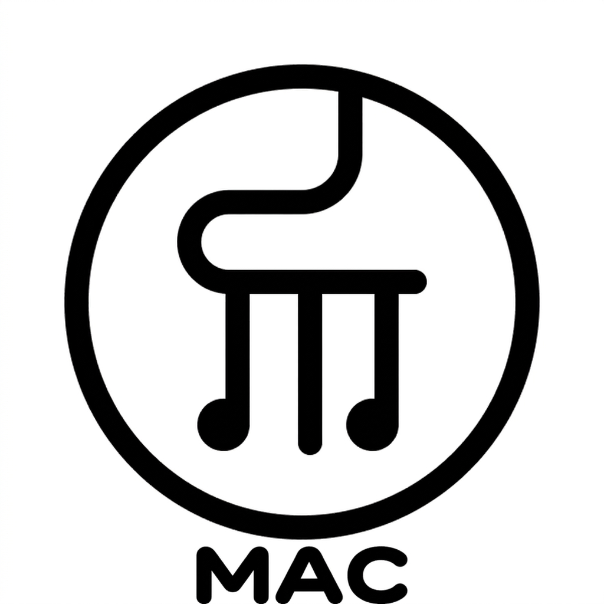

<p align="center">
  
  <br />
  <h1 align="center">YuE2Mac</h1>
  <p align="center">本地 AI 作曲工坊（适用于 Apple Silicon）—— 歌词 + 风格 → 一首完整的歌曲。</p>
  <p align="center">
    <a href="https://github.com/arinltte/YuE2Mac/releases/latest"></a>
    <a href="https://github.com/arinltte/YuE2Mac/blob/main/LICENSE.txt"></a>
    
    
  </p>
</p>

<p align="center">
  <a href="./README.md">English</a> | <a href="./README-ZH.md">中文文档</a>
</p>

## 简介

YuE2Mac 是一款原生 macOS 桌面应用，把开源 [**YuE2**](https://github.com/multimodal-art-projection/YuE) 音乐生成模型（已移植到 **Apple MLX**）带到你的 Apple Silicon Mac 上。输入歌词、选择风格，应用会自动规划编曲、谱写旋律、打磨音色，并渲染出完整的 **48 kHz 立体声歌曲** —— 完全离线运行。

借助在 Apple GPU 上以 8-bit 运行的 YuE2（Mixture-of-Transformers 模型），YuE2Mac **无需联网、无需 API key，所有数据都不离开你的电脑**。你的歌词和歌曲始终留在你的 Mac 上。

> **原始模型与研究：** [YuE 项目主页](https://map-yue2.github.io) · [YuE GitHub](https://github.com/multimodal-art-projection/YuE) · [MERT](https://arxiv.org/abs/2306.00107)

## ✨ 主要特性

*   🌸 **歌词 + 风格 → 完整歌曲**：写自己的歌词或载入内置歌词集，描述音色，就能得到一首完整的歌。
*   🎲 **风格随机（非 AI）**：点击“风格提示”旁的 ↻ 箭头，在预先内置的一批风格描述中轮换——不调用 AI，只是灵感。
*   🧠 **模型版本选择**：安装时会根据你的 Mac 内存与规格自动预选一个版本（**8-bit / 4-bit / bf16**），并只下载该版本。
*   🪗 **编曲规划（COT）**：*Full* 先生成带和弦标记的乐谱；*Melody only* 只生成旋律大纲；*Off* 直接生成声音（最快）。
*   🎚 **质量控制**：细化步数、CFG（对风格的服从程度）、歌曲长度，以及可复现的种子（seed）。
*   🎼 **ABC 乐谱**：开启规划时，生成的 ABC 记谱会与歌曲一起保存，可一键打开。
*   🎹 **纯音乐模式**：一个开关自动注入 *instrumental, no vocals*，并把歌词精简为结构标签——以规避模型偏向人声的特性。
*   ❓ **帮助图标**：每个控件都有说明图标（悬停显示提示，点击弹出说明卡片）。
*   🎨 **氛围主题**：Studio / Stage / Vinyl —— 带动画的氛围背景，并随界面自动适配。
*   ⚡ **智能内存管理**：引擎以子进程方式运行，歌曲结束后立即从内存中卸载，保持 Mac 流畅不卡顿。
*   📦 **一键自动化安装**：按一下按钮，就会从 Hugging Face 自动下载引擎与模型、建立独立的 Python 环境并安装到位——你无需选择任何文件或文件夹。

## ⚙️ 系统要求

应用会自行搭建并安装所需的 Python 环境与依赖。在此之前你需要：

*   **macOS 14.0（Sonoma）** 或更高版本。
*   **Apple Silicon（M1/M2/M3/M4…)** 芯片的 Mac。
*   **[Homebrew](https://brew.sh/)：** 用于提供引导应用私有虚拟环境的 Python ABI。（若缺失，设置界面会给出具体安装命令。）
*   **网络连接：** 仅首次启动需要，用来一次性下载引擎代码、mlx / numpy / tiktoken 依赖包与模型权重。之后便完全离线运行。

## 📥 安装说明

1.  编译并运行（见[编译与运行](#编译与运行)），或从 [Releases 页面](https://github.com/arinltte/YuE2Mac/releases/latest) 下载现成的 `.app`。
2.  首次启动时，**设置界面**会显示你的 Mac 配置（芯片 + 内存），并预选一个**模型版本**：
    *   **8-bit** —— 质量与体积的最佳平衡，推荐 16 GB 及以上内存。
    *   **4-bit** —— 体积最小，更适合 8–12 GB 内存的 Mac。
    *   **bf16** —— 还原度最高，需要 28 GB 以上内存。
3.  点击 **Download & Install**——仅此一步即可。YuE2Mac 会自动完成：
    *   建立独立的 Python 虚拟环境（`~/Library/Application Support/YuE2Mac/Python`）并安装 `mlx`、`numpy`、`tiktoken`；
    *   从 Hugging Face 下载 YuE2 引擎代码与所选模型权重（`Models/<variant>/`）；
    *   校验一切就绪，然后直接进入作曲界面。
4.  完成。之后便是完全离线运行。

> **首次下载大小：** 引擎代码很小，但模型权重较大——默认 8-bit 模型约 **4.2 GB**（4-bit 约 3.4 GB，bf16 约 7 GB）。仅需下载一次。

> **关于未公证说明：** 与许多本地大模型工具类似，首次打开可能会被 Gatekeeper 拦截。可运行：
> `xattr -rd com.apple.quarantine /Applications/YuE2Mac.app`

## 🚀 快速上手

1.  **风格：** 描述氛围/乐器，或按 **↻ 箭头**切换一个现成起始风格。
2.  **歌词：** 输入带结构标签（`[Verse]`、`[Chorus]`…）的歌词，使用标签按钮，或点 **Samples** 载入内置歌词集。
3.  **规划与质量：** 选择 *Full / Melody / Off*，再设置步数、CFG、长度，可选种子以获得可复现的结果。
4.  **生成：** 点击 **Generate Song**。在左下角面板看到友好的进度提示；大按钮在运行中会变成 **Stop**。
5.  **欣赏：** 内联播放结果、打开 **ABC 乐谱**，或 **Show in Finder** 在访达中显示。

## 🧠 功能说明

*   **风格随机（↻）：** 循环遍历 `Presets.swift` 中约 10 条起始风格。不调用 AI，只是按顺序轮换，避免让你面对空白的输入框。
*   **帮助图标（❓）：** 每个滑块/开关在悬停时显示提示，点击时弹出简短的说明卡片。
*   **Samples（歌词）：** 载入现成的歌词集，其中包含一份 **Instrumental only**（纯音乐）模板。
*   **纯音乐：** 向提示词注入 `instrumental, no vocals`，并仅保留歌词中的结构标签。
*   **规划（COT）：** *Full* = 规划和弦+旋律；*Melody only* = 旋律大纲；*Off* = 直接生成声音（最快，但可能失去节拍）。
*   **CFG：** 模型对你风格提示的服从程度。越高越听话，可能也越缺少创造性。
*   **种子（Seed）：** 同样的歌词与种子 = 同样的歌曲。留空则随机生成。

## 🔬 实测生成结果（M4 · 16 GB · 8-bit）

在 **M4 MacBook Pro、16 GB 内存**、使用 **8-bit** 引擎、输入如下内容完成了一次真实基准测试：

> **风格：** `English, soft rock, 70s feel, smooth bass, electric piano, brushed drums`

> **歌词：**
> ```
> [Verse]
> I took my time, I took the slow lane
> Learned to love the quiet rain
>
> [Chorus]
> I bloomed when nobody was watching
> Good things come late, and that's okay
>
> [Verse]
> All my once-upons grew roots at last
> I stopped replaying failed takes from the past
>
> [Chorus]
> I bloomed when nobody was watching
> Good things come late, and that's okay
> ```

| 指标 | 结果 |
| :--- | :--- |
| 模型 | YuE2-3B，8-bit MLX |
| 生成期间内存占用 | **约 11.4 GB**（系统共 16 GB） |
| 设备 | Apple M4 · 16 GB 统一内存 |
| 输出 | 48 kHz 立体声 WAV |

由于引擎作为独立的子进程运行，约 11.4 GB 内存会在歌曲**结束的瞬间被全部释放**——不会有任何内容残留在内存中，因此你的 Mac 在生成结束后不会继续卡顿、发热。

## 🔒 数据与隐私

所有生成都在本地 GPU 上进行。无遥测、无云端 API。

| 位置 | 内容 |
| :--- | :--- |
| `~/Library/Application Support/YuE2Mac/Python` | 隔离的 Python 虚拟环境 + pip 包（mlx、numpy、tiktoken）。 |
| `~/Library/Application Support/YuE2Mac/Scripts` | `generate.py` 与模型模块（从 Hugging Face 下载）。 |
| `~/Library/Application Support/YuE2Mac/Models` | 所选模型权重（8-bit/4-bit/bf16，从 Hugging Face 下载）。 |
| `~/Library/Application Support/YuE2Mac/Output` | 你生成的歌曲（`song.wav`）。 |

## 卸载

```bash
rm -rf /Applications/YuE2Mac.app
rm -rf ~/Library/Application\ Support/YuE2Mac
```

## 编译与运行

```bash
open YuE2Mac.xcodeproj        # 在 Xcode 中点击 Run

# 或直接编译并启动（不带 Xcode 调试器，占用内存更低）：
bash scripts/run_app.sh
```

## 🤝 参与贡献

欢迎一切贡献。方式：Fork 本仓库 → 新建分支 → 清晰提交 → 提交 Pull Request。若反馈 Bug 或功能建议，请到 [Issues](https://github.com/arinltte/YuE2Mac/issues) 提出，并附上你的 macOS 版本与复现步骤。

## 📄 许可证与致谢

YuE2Mac 应用源码以 [MIT 许可证](./LICENSE.txt) 发布。

*   **基础模型：** [**YuE**](https://github.com/multimodal-art-projection/YuE) —— 长篇幅音乐生成的开源基础模型系列，研究主页为 [map-yue2.github.io](https://map-yue2.github.io)。引用时请注明：
    ```bibtex
    @article{li2023mert,
      title = {{MERT}: Acoustic Music Understanding Model with Large-Scale Self-supervised Training},
      author = {Li, Yizhi and Yuan, Ruibin and Zhang, Ge and Ma, Yinghao and Chen, Xingran and Yin, Hanzhi and Xiao, Chenghao and Lin, Chenghua and Ragni, Anton and Benetos, Emmanouil and Gyenge, Norbert and Dannenberg, Roger and Liu, Ruibo and Chen, Wenhu and Xia, Gus and Shi, Yemin and Huang, Wenhao and Wang, Zili and Guo, Yike and Fu, Jie},
      journal = {arXiv preprint arXiv:2306.00107},
      year = {2023},
      eprint = {2306.00107},
      archivePrefix = {arXiv},
      url = {https://arxiv.org/abs/2306.00107}
    }

    @article{yuan2025yue,
      title = {{YuE}: Scaling Open Foundation Models for Long-Form Music Generation},
      author = {Yuan, Ruibin and Lin, Hanfeng and Guo, Shuyue and Zhang, Ge and Pan, Jiahao and Zang, Yongyi and Liu, Haohe and Liang, Yiming and Ma, Wenye and Du, Xingjian and Du, Xinrun and Ye, Zhen and Zheng, Tianyu and Jiang, Zhengxuan and Ma, Yinghao and Liu, Minghao and Tian, Zeyue and Zhou, Ziya and Xue, Liumeng and Qu, Xingwei and Li, Yizhi and Wu, Shangda and Shen, Tianhao and Ma, Ziyang and Zhan, Jun and Wang, Chunhui and Wang, Yatian and Chi, Xiaowei and Zhang, Xinyue and Yang, Zhenzhu and Wang, Xiangzhou and Liu, Shansong and Mei, Lingrui and Li, Peng and Wang, Junjie and Yu, Jianwei and Pang, Guojian and Li, Xu and Wang, Zihao and Zhou, Xiaohuan and Yu, Lijun and Benetos, Emmanouil and Chen, Yong and Lin, Chenghua and Chen, Xie and Xia, Gus and Zhang, Zhaoxiang and Zhang, Chao and Chen, Wenhu and Zhou, Xinyu and Qiu, Xipeng and Dannenberg, Roger and Liu, Jiaheng and Yang, Jian and Huang, Wenhao and Xue, Wei and Tan, Xu and Guo, Yike},
      journal = {arXiv preprint arXiv:2503.08638},
      year = {2025},
      eprint = {2503.08638},
      archivePrefix = {arXiv},
      url = {https://arxiv.org/abs/2503.08638}
    }
    ```
*   **MLX 引擎移植：** 本应用所封装的基础是这个 `YuE2-3B-MLX` 转换工程（`generate.py` 与模型模块）。
*   **计算运行时：** [Apple MLX](https://github.com/ml-explore/mlx)。

感谢开源 AI 社区，让本地音乐生成成为可能。